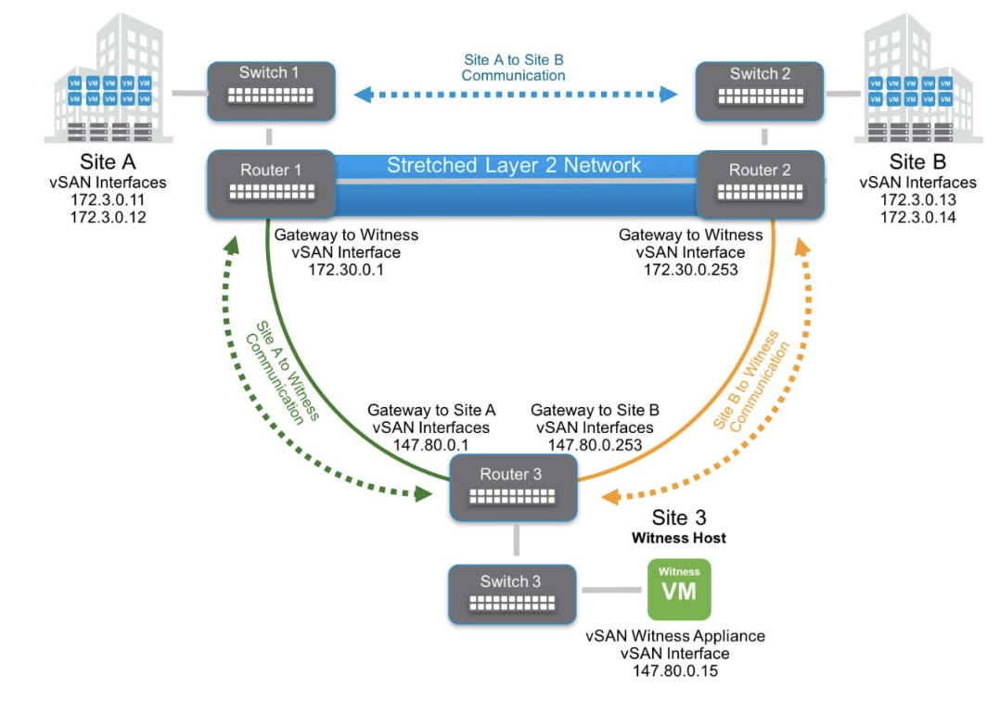
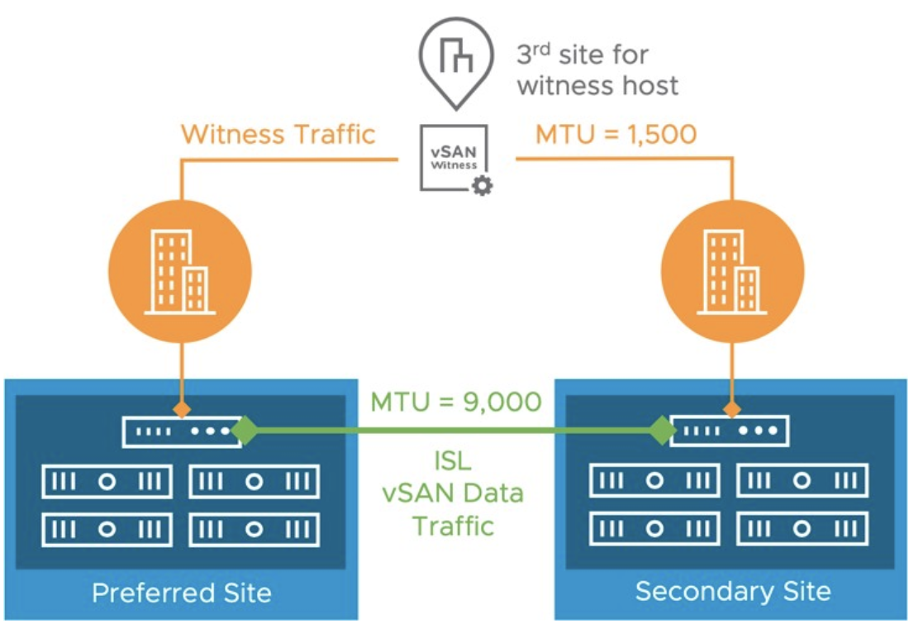
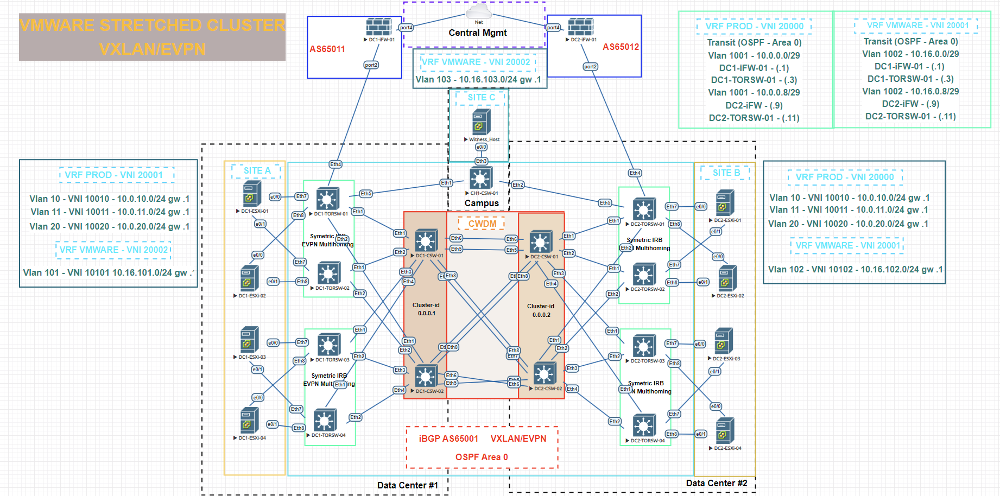

# Проектная пабота
## Проектирование распределенной сети ЦОД с использованием VxLAN EVPN для перехода на использование VMWare Stretched cluster.
### Цели:
- Спроектировать распределенную сеть ЦОД для внедрения VMWare Stretched Cluster;
- Реализовать защиту продуктивного сегмента и сегмента управления средствами МСЭ;
- Получить практический опыт конфигурации и использования технологий VXLAN/EVPN;
- Реализовать свой взгляд на реализацию обеспечения работы VMWare Stretched Cluster и отказоустойчивость распредленных ЦОД.

### Задачи:
- Выработать решение для обеспчения работы VMWare Stretched Cluster;
- Обеспечить защиту продуктивного сегмента и сегмента управления средствами МСЭ

### Бизнес-задачи:
- В организации уже используется VMWare vSphere;
- Возможность создать кластер хранения данных и вычислительных мощностей, решая проблему выхода из строя одного из DC (блек-аут);
- Гибкий перенос инстансов виртуальных машин, распределение нагрузки;
- Реализация гиперконвергентной инфраструктуры.

  
### IP-plan segments
| DC      | NETWORK       | Description     |
|---------|---------------|-----------------|
| DC1     | 172.16.0.0/16 | Loopback1-Spine |
| DC1     | 172.17.0.0/16 | Loopback1-Leaf  |
| DC1     | 172.18.0.0/16 | P2P links       |
| DC1     | 172.19.0.0/16 | Reserve         |
| DC1     | 172.20.0.0/16 | Services        |
| DC2     | 172.21.0.0/16 | Loopback1-Spine |
| DC2     | 172.22.0.0/16 | Loopback1-Leaf  |
| DC2     | 172.23.0.0/16 | P2P links       |
| DC2     | 172.24.0.0/16 | Reserve         |
| DC2     | 172.25.0.0/16 | Services        |
| DC1-DC2 | 172.26.0.0/16 | P2P links DCs   |
| Site A  | 10.0.0.0/12   | Production      |
| Site A  | 10.16.0.0/16  | VMWare Hosts    |
| Site B  | 10.0.0.0/12   | Production      |
| Site B  | 10.16.0.0/16  | VMWare Hosts    |
| Site C  | 10.16.0.0/16  | VMWare Hosts    |

### IP-plan Leaf-Spine/Firewall

#### TORSW = Leaf - Коммутатора доступа ЦОД
#### CSW = Spine - Коммутатор ядра ЦОД
#### FW = Firewall - Межсетевой экран

| Hostname     | Interface         | IP/Mask        | Description                                   |
|--------------|-------------------|----------------|-----------------------------------------------|
| DC1-TORSW-01 | Lo1               | 172.16.0.1/32  | For BGP/EVPN                                  |
| DC1-TORSW-01 | Eth1              | 172.18.0.0/31  | Link to DC1-CSW-01 int Eth1                   |
| DC1-TORSW-01 | Eth2              | 172.18.0.2/31  | Link to DC1-CSW-02 int Eth1                   |
| DC1-TORSW-01 | Eth4              | -              | Link to DC1-FW-01 int Port 2                  |
| DC1-TORSW-01 | Eth4 (VLAN 1001)  | 10.0.0.3/29    | Link to DC1-FW-01 int VLAN 1001 vrf PROD      |
| DC1-TORSW-01 | Eth4 (VLAN 1002)  | 10.16.0.3/29   | Link to DC1-FW-01 int VLAN 1002 vrf VMWARE    |
| DC1-TORSW-01 | Eth5              | 172.18.0.16/31 | Link to CH1-CSW-01 int Eth1                   |
| DC1-TORSW-02 | Lo1               | 172.16.0.2/32  | For BGP/EVPN                                  |
| DC1-TORSW-02 | Eth1              | 172.18.0.6/31  | Link to DC1-CSW-01 int Eth2                   |
| DC1-TORSW-02 | Eth2              | 172.18.0.8/31  | Link to DC1-CSW-02 int Eth2                   |
| DC1-TORSW-03 | Lo1               | 172.16.0.3/32  | For BGP/EVPN                                  |
| DC1-TORSW-03 | Eth1              | 172.18.0.10/31 | Link to DC1-CSW-01 int Eth3                   |
| DC1-TORSW-03 | Eth2              | 172.18.0.12/31 | Link to DC1-CSW-02 int Eth3                   |
| DC1-TORSW-04 | Lo1               | 172.16.0.4/132 | For BGP/EVPN                                  |
| DC1-TORSW-04 | Eth1              | 172.18.0.14/31 | Link to DC1-CSW-01 int Eth4                   |
| DC1-TORSW-04 | Eth2              | 172.18.0.16/31 | Link to DC1-CSW-02 int Eth4                   |
| DC1-CSW-01   | Lo1               | 172.17.0.1/32  | For BGP/EVPN                                  |
| DC1-CSW-01   | Eth1              | 172.18.0.1/31  | Link to DC1-TORSW-01 int Eth1                 |
| DC1-CSW-01   | Eth2              | 172.18.0.7/31  | Link to DC1-TORSW-02int Eth1                  |
| DC1-CSW-01   | Eth3              | 172.18.0.11/31 | Link to DC1-TORSW-03 int Eth1                 |
| DC1-CSW-01   | Eth4              | 172.18.0.15/31 | Link to DC1-TORSW-04 int Eth1                 |
| DC1-CSW-01   | Eth5              | 172.26.0.0/31  | Link to DC2-CSW-01 int Eth5                   |
| DC1-CSW-01   | Eth6              | 172.26.0.2/31  | Link to DC2-CSW-01 int Eth6                   |
| DC1-CSW-01   | Eth7              | 172.26.0.4/31  | Link to DC2-CSW-02 int Eth7                   |
| DC1-CSW-01   | Eth8              | 172.26.0.6/31  | Link to DC2-CSW-02 int Eth8                   |
| DC1-CSW-02   | Lo1               | 172.17.0.2/32  | For BGP/EVPN                                  |
| DC1-CSW-02   | Eth1              | 172.18.0.3/31  | Link to DC1-TORSW-01 int Eth2                 |
| DC1-CSW-02   | Eth2              | 172.18.0.9/31  | Link to DC1-TORSW-02int Eth2                  |
| DC1-CSW-02   | Eth3              | 172.18.0.13/31 | Link to DC1-TORSW-03 int Eth2                 |
| DC1-CSW-02   | Eth4              | 172.18.0.17/31 | Link to DC1-TORSW-04 int Eth2                 |
| DC1-CSW-02   | Eth5              | 172.26.0.8/31  | Link to DC2-CSW-02 int Eth5                   |
| DC1-CSW-02   | Eth6              | 172.26.0.10/31 | Link to DC2-CSW-02int Eth6                    |
| DC1-CSW-02   | Eth7              | 172.26.0.12/31 | Link to DC2-CSW-01 int Eth7                   |
| DC1-CSW-02   | Eth8              | 172.26.0.14/31 | Link to DC2-CSW-01 int Eth8                   |
| DC1-FW-01    | Port2             | -              | Link to DC1-TORSW-01 int Eth4                 |
| DC1-FW-01    | Port2 (VLAN 1001) | 10.0.0.1/29    | Link to DC1-TORSW-01 int VLAN 1001 vrf PROF   |
| DC1-FW-01    | Port2 (VLAN 1002) | 10.16.0.1/29   | Link to DC1-TORSW-01 int VLAN 1002 vrf VMWARE |
| DC2-TORSW-01 | Lo1               | 172.22.0.1/32  | For BGP/EVPN                                  |
| DC2-TORSW-01 | Eth1              | 172.23.0.0/31  | Link to DC2-CSW-01 int Eth1                   |
| DC2-TORSW-01 | Eth2              | 172.23.0.2/31  | Link to DC2-CSW-02 int Eth1                   |
| DC2-TORSW-01 | Eth4              | -              | Link to DC2-FW-01 int Port 2                  |
| DC2-TORSW-01 | Eth4 (VLAN 1001)  | 10.0.0.11/29   | Link to DC2-FW-01 int VLAN 1001 vrf PROD      |
| DC2-TORSW-01 | Eth4 (VLAN 1002)  | 10.16.0.11/29  | Link to DC2-FW-01 int VLAN 1002 vrf VMWARE    |
| DC2-TORSW-01 | Eth5              | 172.23.0.16/31 | Link to CH1-CSW-01 int Eth2                   |
| DC2-TORSW-02 | Lo1               | 172.22.0.2/32  | For BGP/EVPN                                  |
| DC2-TORSW-02 | Eth1              | 172.23.0.4/31  | Link to DC2-CSW-01 int Eth2                   |
| DC2-TORSW-02 | Eth2              | 172.23.0.6/31  | Link to DC2-CSW-02 int Eth2                   |
| DC2-TORSW-03 | Lo1               | 172.22.0.3/32  | For BGP/EVPN                                  |
| DC2-TORSW-03 | Eth1              | 172.23.0.8/31  | Link to DC2-CSW-01 int Eth3                   |
| DC2-TORSW-03 | Eth2              | 172.23.0.10/31 | Link to DC2-CSW-02 int Eth3                   |
| DC2-TORSW-04 | Lo1               | 172.22.0.4/32  | For BGP/EVPN                                  |
| DC2-TORSW-04 | Eth1              | 172.23.0.12/31 | Link to DC2-CSW-01 int Eth4                   |
| DC2-TORSW-04 | Eth2              | 172.23.0.14/31 | Link to DC2-CSW-02 int Eth4                   |
| DC2-CSW-01   | Lo1               | 172.21.0.1/32  | For BGP/EVPN                                  |
| DC2-CSW-01   | Eth1              | 172.23.0.1/31  | Link to DC2-TORSW-01 int Eth1                 |
| DC2-CSW-01   | Eth2              | 172.23.0.5/31  | Link to DC2-TORSW-02int Eth1                  |
| DC2-CSW-01   | Eth3              | 172.23.0.9/31  | Link to DC2-TORSW-03 int Eth1                 |
| DC2-CSW-01   | Eth4              | 172.23.0.13/31 | Link to DC2-TORSW-04 int Eth1                 |
| DC2-CSW-01   | Eth5              | 172.26.0.1/31  | Link to DC1-CSW-01 int Eth5                   |
| DC2-CSW-01   | Eth6              | 172.26.0.3/31  | Link to DC1-CSW-01 int Eth6                   |
| DC2-CSW-01   | Eth7              | 172.26.0.13/31 | Link to DC1-CSW-02 int Eth7                   |
| DC2-CSW-01   | Eth8              | 172.26.0.15/31 | Link to DC1-CSW-02 int Eth8                   |
| DC2-CSW-02   | Lo1               | 172.21.0.2/32  | For BGP/EVPN                                  |
| DC2-CSW-02   | Eth1              | 172.23.0.3/31  | Link to DC2-TORSW-01 int Eth2                 |
| DC2-CSW-02   | Eth2              | 172.23.0.7/31  | Link to DC2-TORSW-02int Eth2                  |
| DC2-CSW-02   | Eth3              | 172.23.0.11/31 | Link to DC2-TORSW-03 int Eth2                 |
| DC2-CSW-02   | Eth4              | 172.23.0.15/31 | Link to DC2-TORSW-04 int Eth2                 |
| DC2-CSW-02   | Eth5              | 172.26.0.9/31  | Link to DC1-CSW-02 int Eth5                   |
| DC2-CSW-02   | Eth6              | 172.26.0.11/31 | Link to DC1-CSW-02int Eth6                    |
| DC2-CSW-02   | Eth7              | 172.26.0.5/31  | Link to DC1-CSW-01 int Eth7                   |
| DC2-CSW-02   | Eth8              | 172.26.0.7/31  | Link to DC1-CSW-01 int Eth8                   |
| DC2-FW-01    | Port2             | -              | Link to DC2-TORSW-01 int Eth4                 |
| DC2-FW-01    | Port2 (VLAN 1001) | 10.0.0.9/29    | Link to DC2-TORSW-01 int VLAN 1001 vrf PROF   |
| DC2-FW-01    | Port2 (VLAN 1002) | 10.16.0.9/29   | Link to DC2-TORSW-01 int VLAN 1002 vrf VMWARE |
| CH1-CSW-01   | Lo1               | 172.19.0.1/32  | For BGP/EVPN                                  |
| CH1-CSW-01   | Eth1              | 172.18.0.17/31 | Link to DC1-TORSW-01 int Eth5                 |
| CH1-CSW-01   | Eth2              | 172.23.0.17/31 | Link to DC2-TORSW-01 int Eth5                 |

### IP-plan ESXi Hosts
| Hostname     | Interface | IP/Mask      | Description |
|--------------|-----------|--------------|-------------|
| DC1-ESXi-01  | VLAN 10   | 10.0.10.11   | vrf PROD    |
| DC1-ESXi-01  | VLAN 11   | 10.0.11.11   | vrf PROD    |
| DC1-ESXi-01  | VLAN 20   | 10.0.20.11   | vrf PROD    |
| DC1-ESXi-01  | VLAN 101  | 10.16.101.11 | vrf VMWARE  |
| DC1-ESXi-02  | VLAN 10   | 10.0.10.12   | vrf PROD    |
| DC1-ESXi-02  | VLAN 11   | 10.0.11.12   | vrf PROD    |
| DC1-ESXi-02  | VLAN 20   | 10.0.20.12   | vrf PROD    |
| DC1-ESXi-02  | VLAN 101  | 10.16.101.12 | vrf VMWARE  |
| DC1-ESXi-03  | VLAN 10   | 10.0.10.13   | vrf PROD    |
| DC1-ESXi-03  | VLAN 11   | 10.0.11.13   | vrf PROD    |
| DC1-ESXi-03  | VLAN 20   | 10.0.20.13   | vrf PROD    |
| DC1-ESXi-03  | VLAN 101  | 10.16.101.13 | vrf VMWARE  |
| DC1-ESXi-04  | VLAN 10   | 10.0.10.14   | vrf PROD    |
| DC1-ESXi-04  | VLAN 11   | 10.0.11.14   | vrf PROD    |
| DC1-ESXi-04  | VLAN 20   | 10.0.20.14   | vrf PROD    |
| DC1-ESXi-04  | VLAN 101  | 10.16.101.14 | vrf VMWARE  |
| DC2-ESXi-01  | VLAN 10   | 10.0.10.21   | vrf PROD    |
| DC2-ESXi-01  | VLAN 11   | 10.0.11.21   | vrf PROD    |
| DC2-ESXi-01  | VLAN 20   | 10.0.20.21   | vrf PROD    |
| DC2-ESXi-01  | VLAN 102  | 10.16.102.2  | vrf VMWARE  |
| DC2-ESXi-02  | VLAN 10   | 10.0.10.22   | vrf PROD    |
| DC2-ESXi-02  | VLAN 11   | 10.0.11.22   | vrf PROD    |
| DC2-ESXi-02  | VLAN 20   | 10.0.20.22   | vrf PROD    |
| DC2-ESXi-02  | VLAN 102  | 10.16.102.22 | vrf VMWARE  |
| DC2-ESXi-03  | VLAN 10   | 10.0.10.23   | vrf PROD    |
| DC2-ESXi-03  | VLAN 11   | 10.0.11.23   | vrf PROD    |
| DC2-ESXi-03  | VLAN 20   | 10.0.20.23   | vrf PROD    |
| DC2-ESXi-03  | VLAN 102  | 10.16.102.23 | vrf VMWARE  |
| DC2-ESXi-04  | VLAN 10   | 10.0.10.24   | vrf PROD    |
| DC2-ESXi-04  | VLAN 11   | 10.0.11.24   | vrf PROD    |
| DC2-ESXi-04  | VLAN 20   | 10.0.20.24   | vrf PROD    |
| DC2-ESXi-04  | VLAN 102  | 10.16.102.24 | vrf VMWARE  |
| Witness Host | VLAN 103  | 10.16.103.10 | vrf VMWARE  |

### Общая схема организации VMWare Stretched cluster

### Ограничения VMWare Stretched cluster

#### Для работы VMWare Stretched cluster требуется 2-е площадки где будeт распологаться кластеры ESXi и Witness (Свидетель).

- Обязательное наличие отдельной площадки, на которой будет располагаться Witness Host. Данная площадка должна быть связана хорошими каналами по IP с обоими Дата Центрами, где будут находиться ноды Stretched VSAN кластера. Именно с помощью данного этого дополнительного элемента управления кластер сможет понимать какая его часть находится в работоспособном состоянии, а какая нет. Так же надо понимать, что Witness Host может быть в виде гипервизора ESXi, либо в виде виртуальной машины, которая работает в среде VMware vSphere;
- Наличие хороших каналов связи между двумя площадками, где будут располагаться ноды растянутого VSAN кластера. Так жесткими требованиям при этом является наличие 10 гигабитной полосы пропускания между обоими основными площадками, а также величина задержек менее 5 ms RTT (round trip time) на этом пути. Эти требования ограничивают возможности данной технологии одной метрополией;
- Пропускная способность не менее 10 Гбит/c между основным площадками, не менее 5 ms RTT. Для каждых 1000 элементов файловой системы VSAN требуется полоса пропускания в 2 Mb/s между нодами кластера и площадкой с Witness Host. RTT должны быть менее 200 ms при количестве нод менее 10 на каждой площадке, или менее 100 ms, при большем количестве нод кластера;
- Специальные VLAN выделенные для VSAN, vMotion и Management трафика должны быть связаны между обоими основными площадками. L2 или L3 связность. Witness трафик между всеми нодами кластера и Witness хостом должен соответствующим образом коммутироваться или маршрутизироваться.

### Топология сети

- В текущей топологии используется Leaf-Spine архитектура для построения сетей ЦОД, фактически имеется 2-ва POD разнесенных географически, связанных высокоскростнымм каналами связи c использованием CWDM;
- Выполнен отказ от использования стека коммутаров ядра для того чтобы получить отказоустойчивость на Control Plane;
- Не используется Super Spine посольку подразумевается ограничение кол-ва стоек на площадке 20-25, а VMWARE Streched Cluster не подразумевает более 2-ух основных сайтов;
- Для базовой IP связности и настройки EVPN используется связка OSPF/iBGP для более простой настройки;
- Для L3 связности между продуктивным сегментом (PROD) и сегментов управления (VMWARE) используется eBGP пиринг с межсетевыми экранами FortiGate в соотвествующих VRF;
- Для подключение ESXi хостов агрегированым каналом к Leaf коммутаторам используется EVPN Multi-homing;
- Для того чтобы виртуальные машины могли  распределнного шлюза используеся EVPN VXLAN Anycast Gateway.
